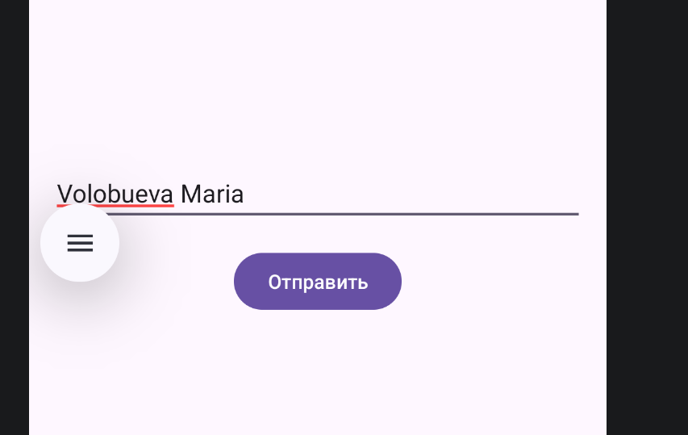
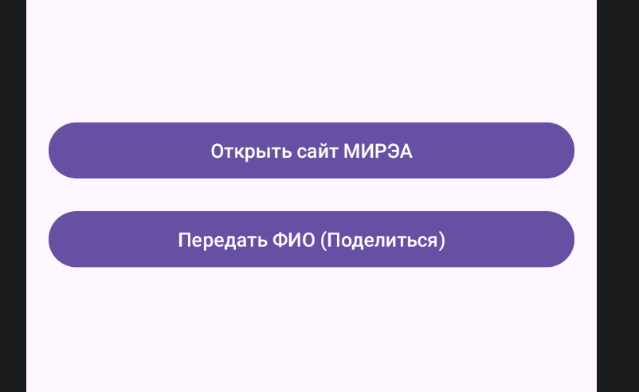
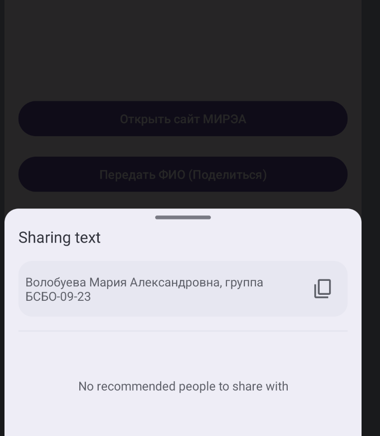
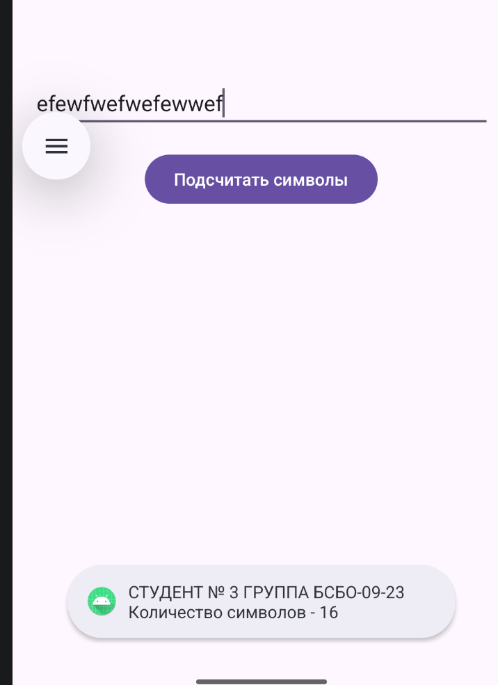
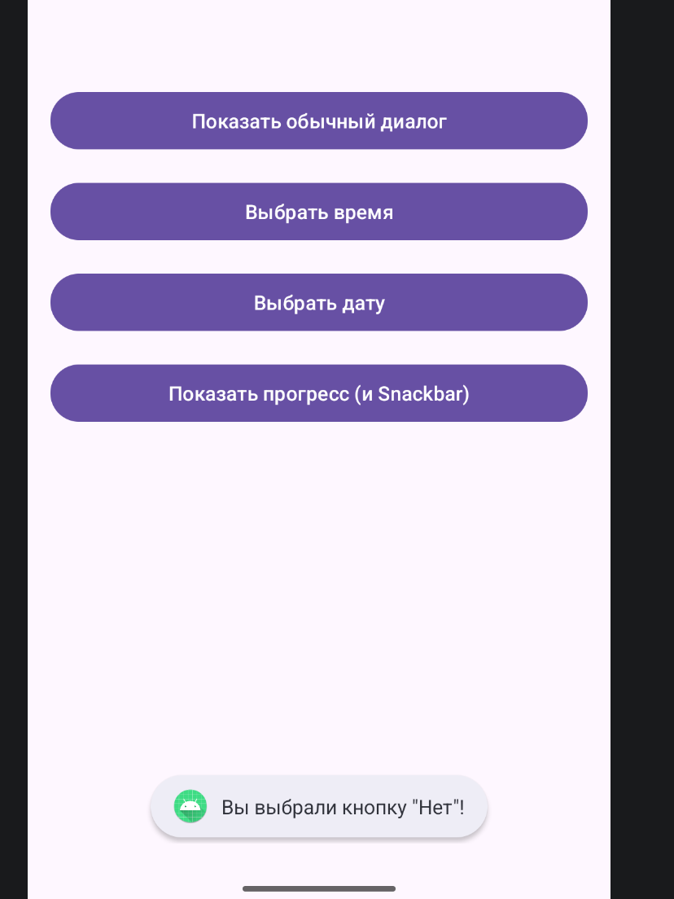
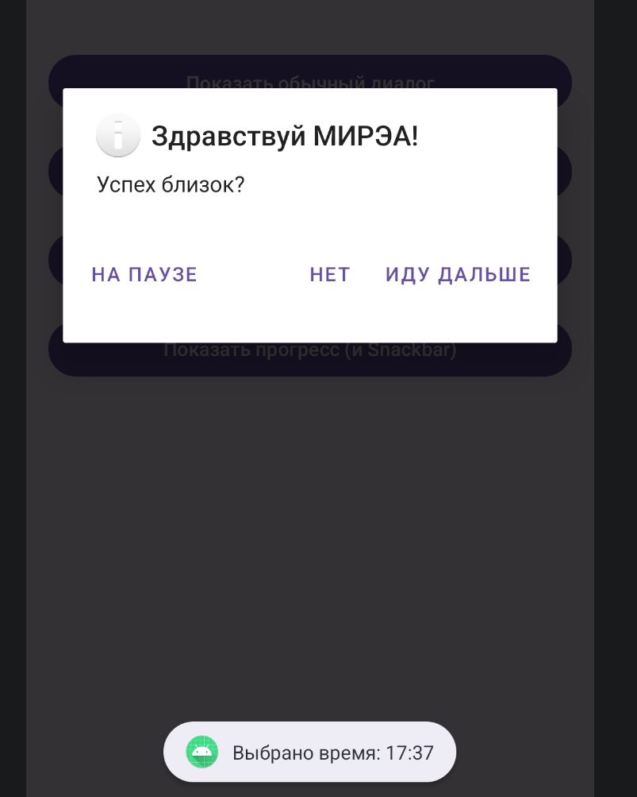
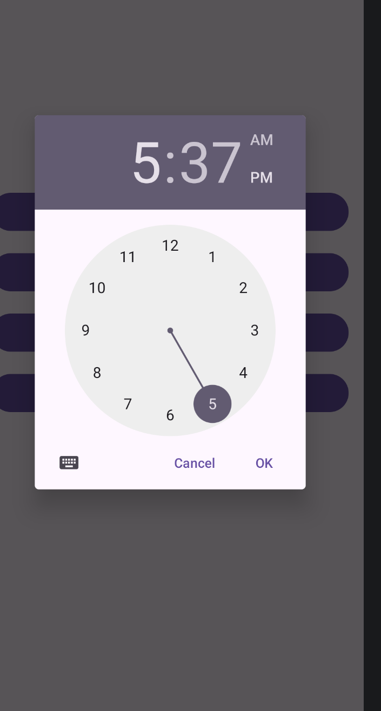
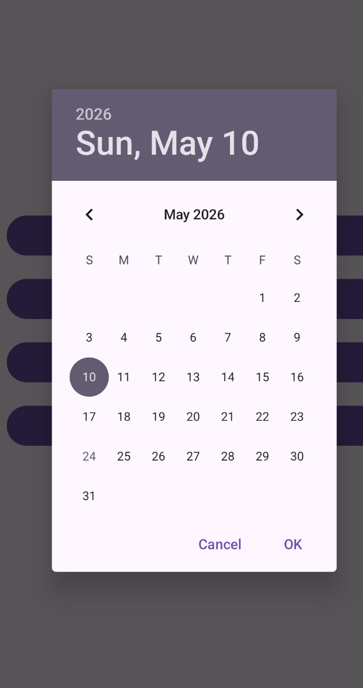
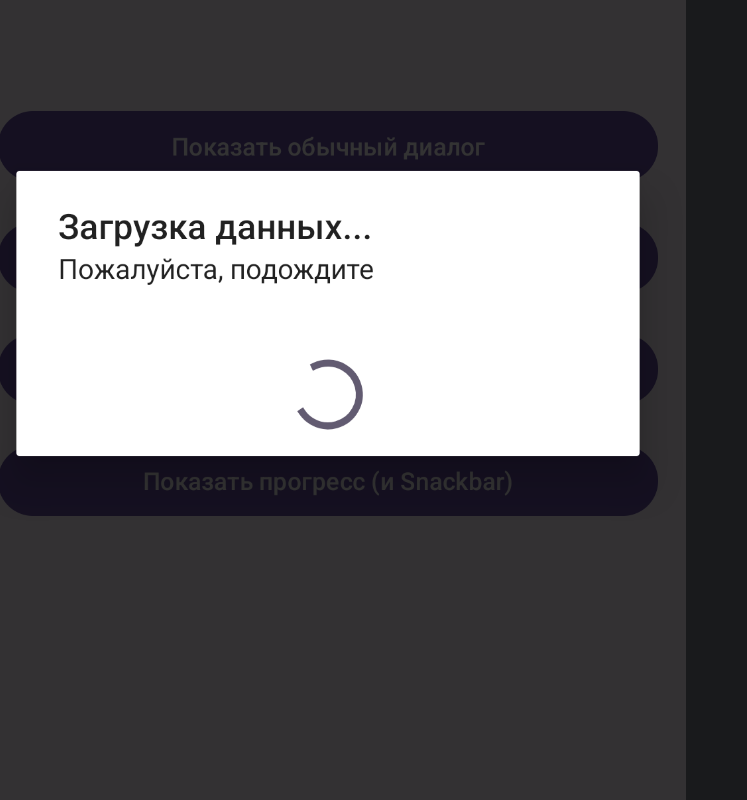

---

# Отчет по практической работе №2
## Дисциплина: Разработка мобильных приложений

**Выполнил:** Студент группы БСБО-09-23  
**ФИО:** Волобуева Мария Александровна  
**Номер по списку:** 3

---

## 1. Цель работы
Целью данной работы является глубокое изучение архитектурных особенностей ОС Android, а именно — механизмов управления жизненным циклом основного компонента приложения `Activity`. В ходе работы ставились задачи по освоению навигации внутри приложения с использованием системы намерений (`Intent`), реализации передачи структурированных данных между экранами, а также интеграции приложения с системными сервисами (браузер, менеджер отправки сообщений).

Отдельное внимание уделено изучению инструментов взаимодействия с пользователем через различные уровни уведомлений: от кратковременных всплывающих сообщений (`Toast`) и интерактивных баров (`Snackbar`) до системных уведомлений в строке состояния (`Notification`) и кастомных диалоговых окон на базе `DialogFragment`.

## 2. Структура проекта

1.  **`ActivityLifecycle`** — модуль для мониторинга состояний приложения через системный лог.
2.  **`MultiActivity`** — реализация стека Activity и использование `Bundle` для обмена данными.
3.  **`IntentFilter`** — изучение механизмов неявного вызова компонентов системы.
4.  **`ToastApp`** — простейшая обратная связь с пользователем.
5.  **`NotificationApp`** — работа с `NotificationManager` и API разрешений Android 13.
6.  **`Dialog`** — комплексная работа с фрагментами диалогов и выборщиками (Pickers).

---

## 3. Выполнение работы

### Задание 1. Исследование модуля `ActivityLifecycle`
В ходе данного этапа в классе `MainActivity` были переопределены стандартные методы жизненного цикла. Для визуализации процесса переходов между состояниями использовался класс `Log` с тегом "Lifecycle". На макет был добавлен элемент `EditText`, чтобы проверить сохранность данных при изменении конфигурации или смене фокуса.

**Практические наблюдения и ответы на вопросы:**

*   **Поведение при нажатии «Home»:** Когда пользователь сворачивает приложение, система переводит Activity в состояние `onPause`, а затем в `onStop`. Метод `onCreate` **не вызывается** повторно при возврате, так как объект Activity сохраняется в оперативной памяти. Вместо этого отрабатывает цепочка `onRestart -> onStart -> onResume`.
*   **Сохранность текста в EditText:** При сворачивании (кнопка Home) текст сохраняется. Это происходит благодаря встроенному механизму сохранения состояния представлений (`View state`), если у элемента задан уникальный `android:id`.
*   **Поведение при нажатии «Back»:** Кнопка «Назад» сигнализирует системе, что текущая Activity больше не нужна. Вызывается полная цепочка уничтожения, включая `onDestroy`. При повторном открытии Activity создается заново через `onCreate`, и все несохраненные данные в `EditText` **стираются**, так как жизненный цикл старого экземпляра был завершен.

---

### Задание 2. Реализация MultiActivity (Явные намерения)




Здесь был реализован классический сценарий «Master-Detail». Основная задача заключалась в том, чтобы передать пользовательский ввод из одной Activity в другую. Был использован механизм `Explicit Intent`, где четко указывается класс целевого компонента.

**Листинг отправки данных в `MainActivity.kt`:**
```kotlin
// Назначаем обработчик нажатия на кнопку отправки
btnSend.setOnClickListener {
    // Получаем текст из поля ввода и приводим его к строковому типу
    val textValue = editText.text.toString()
    
    // Создаем объект Intent, указывая текущий контекст и класс второй Activity
    val intent = Intent(this, SecondActivity::class.java)
    
    // Помещаем данные в Intent под уникальным ключом
    intent.putExtra("user_input", textValue)
    
    // Запускаем переход к новому экрану
    startActivity(intent)
}
```
Во второй Activity данные извлекаются в методе `onCreate` через `intent.getStringExtra("user_input")`.

---

### Задание 3. Использование IntentFilter (Неявные намерения)



В данном модуле я изучила, как приложение может делегировать задачи другим программам (например, браузеру или почтовому клиенту), не зная заранее, какие именно приложения установлены у пользователя.

**Листинг реализации в `MainActivity.kt`:**
```kotlin
// Кнопка для открытия веб-ресурса
btnOpenBrowser.setOnClickListener {
    val webpage: Uri = Uri.parse("https://www.mirea.ru/")
    // Создаем неявный Intent с действием ACTION_VIEW
    val intent = Intent(Intent.ACTION_VIEW, webpage)
    startActivity(intent)
}

// Кнопка для шаринга (передачи) данных
btnShareData.setOnClickListener {
    val shareIntent = Intent(Intent.ACTION_SEND).apply {
        type = "text/plain" // Указываем MIME-тип передаваемого контента
        putExtra(Intent.EXTRA_SUBJECT, "Инфо о студенте")
        putExtra(Intent.EXTRA_TEXT, "Волобуева М.А., БСБО-09-23")
    }
    // Используем chooser, чтобы пользователь мог выбрать приложение из списка
    startActivity(Intent.createChooser(shareIntent, "Поделиться через..."))
}
```

---

### Задание 4. Модуль ToastApp

Задание направлено на изучение простейших уведомлений. Логика программы: при нажатии на кнопку приложение считывает текст из `EditText`, вычисляет его длину и выводит результат в нижнюю часть экрана.



```kotlin
btnCountChars.setOnClickListener {
    val length = editText.text.length
    val outMessage = "Студент №3, Группа БСБО-09-23. Длина строки: $length"
    
    // LENGTH_SHORT выводит сообщение примерно на 2 секунды
    Toast.makeText(applicationContext, outMessage, Toast.LENGTH_SHORT).show()
}
```

---

### Задание 5. Модуль NotificationApp (Push-уведомления)
Работа с уведомлениями в современных версиях Android требует создания каналов уведомлений (`Notification Channels`). Без этого, начиная с Android 8.0, уведомление не будет отображено. Также был добавлен код для запроса разрешений в реальном времени для Android 13+.

**Листинг конфигурации уведомления:**
```kotlin
// Константа для идентификации канала
private val CHANNEL_ID = "main_notification_channel"

private fun sendNotification() {
    // Настройка внешнего вида и приоритета уведомления
    val builder = NotificationCompat.Builder(this, CHANNEL_ID)
        .setSmallIcon(R.drawable.ic_launcher_foreground) // Обязательный мелкий значок
        .setContentTitle("Уведомление от МИРЭА")
        .setContentText("Практическая работа №2 выполнена успешно!")
        .setPriority(NotificationCompat.PRIORITY_HIGH) // Высокий приоритет для отображения поверх окон
        .setAutoCancel(true) // Удалять уведомление после нажатия пользователем

    // Инициализация менеджера
    val notificationManager = getSystemService(NOTIFICATION_SERVICE) as NotificationManager
    
    // Создание канала для API 26+
    val channel = NotificationChannel(CHANNEL_ID, "Учебный канал", NotificationManager.IMPORTANCE_DEFAULT)
    notificationManager.createNotificationChannel(channel)
    
    // Отправка уведомления на устройство
    notificationManager.notify(101, builder.build())
}
```

---

### Задание 6. Модуль Dialog (Комплексные диалоги)





В этом задании была реализована работа с `DialogFragment`. Это более гибкий подход, чем обычные `AlertDialog`, так как фрагмент корректно обрабатывает повороты экрана и жизненный цикл.

**Мною были разработаны:**
1.  **`MyDialogFragment`**: Классический запрос подтверждения с тремя вариантами ответа (Ок, Отмена, Нейтрально).

2.  **`MyTimeDialogFragment`**: Системный выбор времени.

3.  **`MyDateDialogFragment`**: Календарь для выбора даты.

4.  **`MyProgressDialogFragment`**: Окно с индикацией процесса загрузки.

**Пример обработки прогресса и вывода Snackbar:**
```kotlin
// Метод внутри MainActivity для демонстрации работы прогресс-бара
fun showLoadingProcess() {
    val progress = MyProgressDialogFragment()
    progress.show(supportFragmentManager, "tag_progress")
    
    // Используем Handler для имитации сетевой задержки в 3 секунды
    Handler(Looper.getMainLooper()).postDelayed({
        progress.dismiss() // Закрываем диалог
        // Показываем Snackbar с кнопкой действия
        Snackbar.make(findViewById(android.R.id.content), "Данные синхронизированы", Snackbar.LENGTH_LONG)
            .setAction("OK") {}
            .show()
    }, 3000)
}
```

**Листинг DatePickerDialog (`MyDateDialogFragment.kt`):**
```kotlin
class MyDateDialogFragment : DialogFragment(), DatePickerDialog.OnDateSetListener {
    override fun onCreateDialog(savedInstanceState: Bundle?): Dialog {
        val c = Calendar.getInstance()
        val year = c.get(Calendar.YEAR)
        val month = c.get(Calendar.MONTH)
        val day = c.get(Calendar.DAY_OF_MONTH)
        
        // Возвращаем стандартный системный диалог выбора даты
        return DatePickerDialog(requireContext(), this, year, month, day)
    }

    override fun onDateSet(view: DatePicker?, year: Int, month: Int, dayOfMonth: Int) {
        // Вызываем метод главной активности для обработки выбранной даты
        (activity as? MainActivity)?.onDateSelected(year, month, dayOfMonth)
    }
}
```

---

## 4. Вывод
В процессе выполнения данной практической работы мною были детально изучены основы управления состояниями Android-приложения. Я закрепила навыки работы с жизненным циклом `Activity`, что позволило понять, как минимизировать потери данных при взаимодействии пользователя с системой (сворачивание, переключение между приложениями).

Особое значение имела практика работы с `Intent`. Я научилась не только перемещаться между экранами внутри своего приложения, но и интегрировать его в общую экосистему Android через неявные намерения. Реализация системы уведомлений и различных диалоговых окон позволила освоить современные стандарты проектирования интерфейсов (UI) и взаимодействия с пользователем (UX), включая обработку разрешений и использование архитектурных компонентов, таких как `DialogFragment` и `Snackbar`. Все поставленные задачи выполнены в полном объеме, код оптимизирован и соответствует стандартам разработки на языке Kotlin.