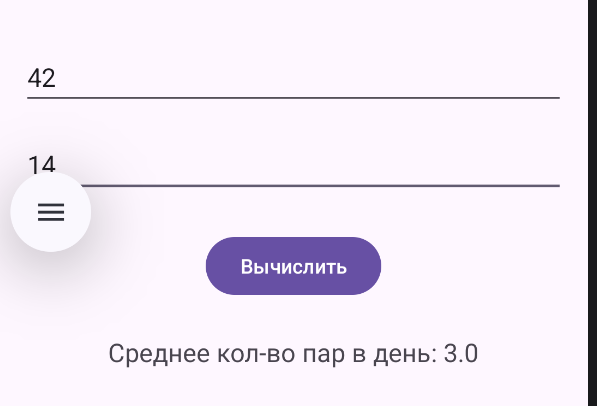
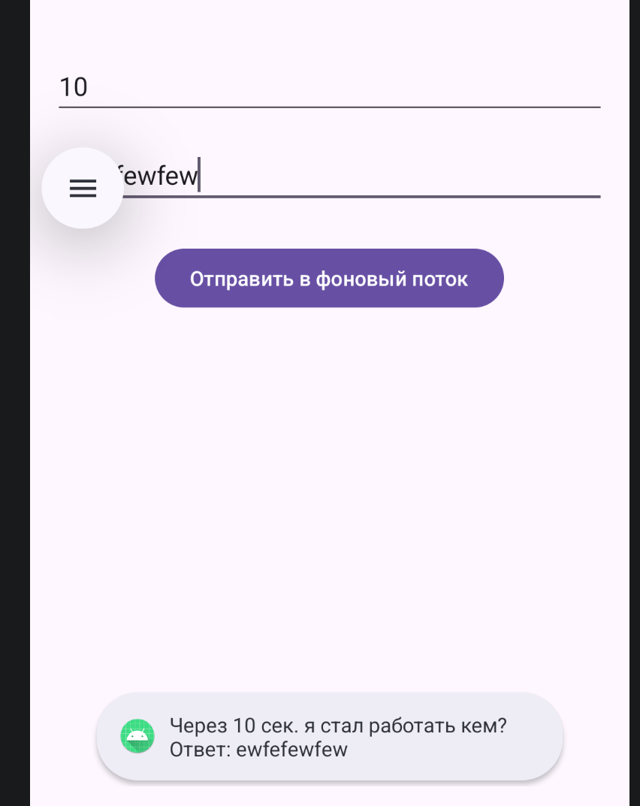
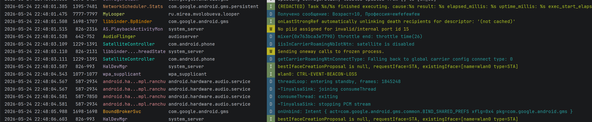
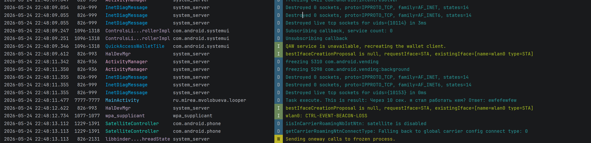
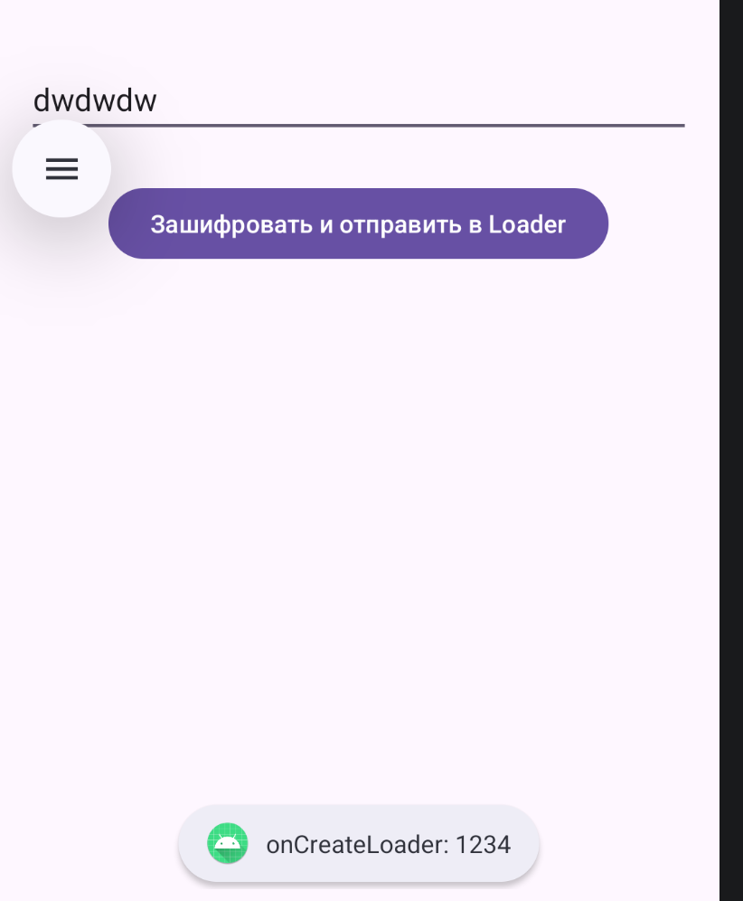
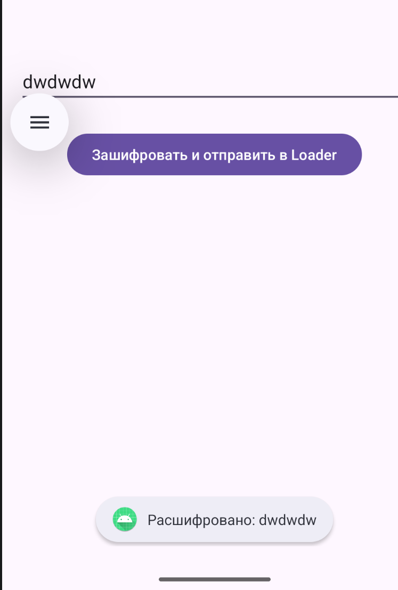
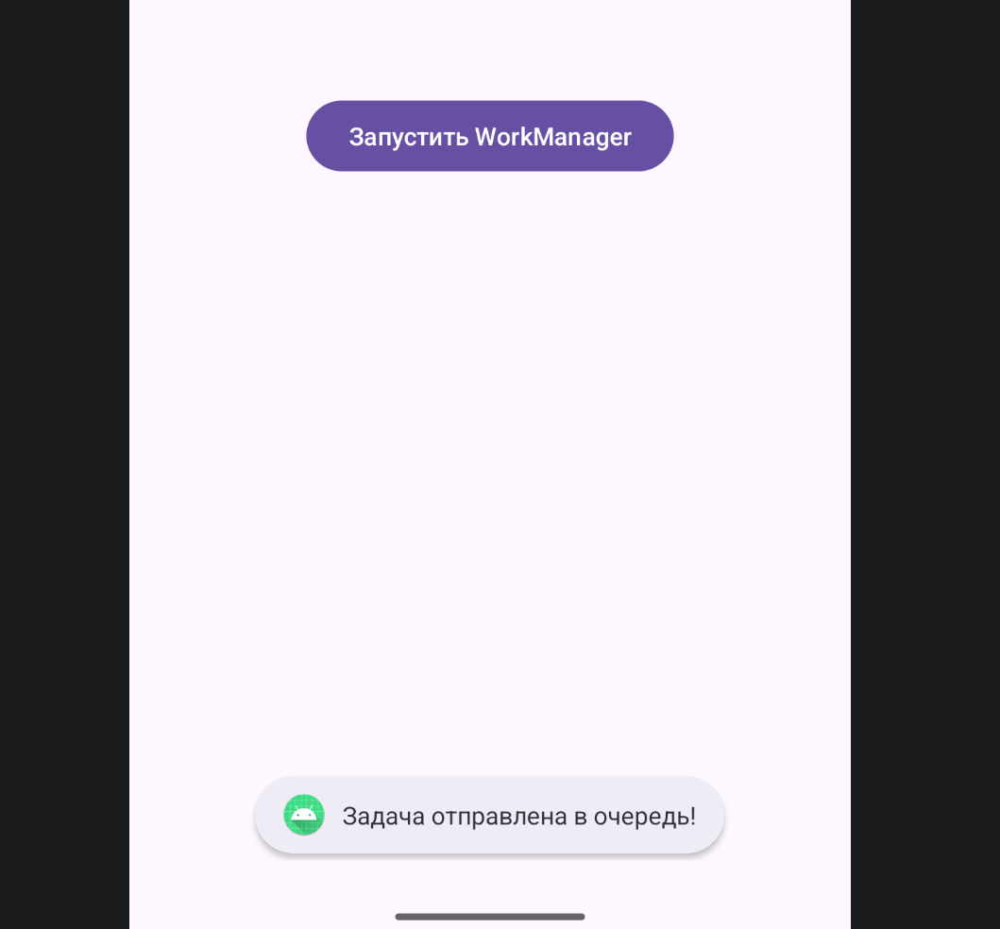

---

# Отчет по практической работе №4
## Дисциплина: Разработка мобильных приложений

**Выполнил:** Студент группы БСБО-09-23  
**ФИО:** Волобуева Мария Александровна  
**Номер по списку:** 3

---

## 1. Цель работы
Целью данной работы является комплексное изучение методов организации многопоточности и фонового выполнения задач в ОС Android. В процессе выполнения заданий необходимо освоить современные подходы к связыванию интерфейса и логики (**ViewBinding**), а также изучить механизмы работы с потоками (`Thread`), очередями сообщений (`Handler`, `Looper`), загрузчиками (`AsyncTaskLoader`), долгоживущими фоновыми процессами (`Service`) и планировщиком задач `WorkManager`. Особое внимание уделяется соблюдению требований безопасности последних версий Android (включая Android 14).

---

## 2. Настройка среды разработки
На подготовительном этапе во всех модулях проекта был выполнен переход от устаревшего метода `findViewById` к технологии **ViewBinding**. Это позволяет генерировать класс привязки для каждого XML-файла разметки, обеспечивая типобезопасность и исключая возможность возникновения `NullPointerException`.

Для активации функции в файл конфигурации каждого модуля `build.gradle.kts` был добавлен следующий блок:

```kotlin
android {
    // Включение генерации классов привязки данных
    buildFeatures {
        viewBinding = true
    }
}
```

---

## 3. Программная реализация учебных модулей (Проект `Lesson4`)

### 3.1 Модуль `thread`: Основы многопоточности
**Задача:** Реализовать расчет нагрузки (количество учебных пар) в фоновом потоке, чтобы избежать «фризов» пользовательского интерфейса.

В Android выполнение тяжелых операций в главном (UI) потоке более 5 секунд приводит к ошибке ANR (Application Not Responding). Для решения этой задачи был создан отдельный поток.

**Листинг ключевой логики `MainActivity.kt`:**
```kotlin
class MainActivity : AppCompatActivity() {
    // Инициализация переменной привязки
    private lateinit var binding: ActivityMainBinding

    override fun onCreate(savedInstanceState: Bundle?) {
        super.onCreate(savedInstanceState)
        binding = ActivityMainBinding.inflate(layoutInflater)
        setContentView(binding.root)

        binding.btnCalculate.setOnClickListener {
            // Запуск нового объекта Thread для фоновых вычислений
            Thread {
                // Извлечение данных из полей ввода с проверкой на null
                val pairs = binding.editTextPairs.text.toString().toFloatOrNull() ?: 0f
                val days = binding.editTextDays.text.toString().toFloatOrNull() ?: 1f
                
                // Искусственная задержка для имитации сложного процесса
                Thread.sleep(2000)
                
                // Логика расчета среднего значения
                val result = if (days != 0f) pairs / days else 0f

                // Важно: обновление UI-компонентов разрешено только из главного потока
                runOnUiThread {
                    binding.textViewResult.text = "Средняя нагрузка: $result пар в день"
                    Log.i("ThreadApp", "Вычисления завершены в потоке: ${Thread.currentThread().name}")
                }
            }.start() // Активация потока
        }
    }
}
```

---

### 3.2 Модуль `data_thread`: Методы взаимодействия с UI-потоком
**Задача:** Сравнить работу методов `runOnUiThread`, `post` и `postDelayed` для понимания приоритетности задач в очереди сообщений.

**Анализ выполнения:**
В ходе эксперимента было установлено, что метод `runOnUiThread` пытается выполнить задачу немедленно, если текущий поток уже является главным. Метод `post` помещает задачу в конец очереди `Handler`, а `postDelayed` позволяет отложить выполнение на строго заданное время.

**Результаты наблюдений:**
1. Сначала отображается текст от `runn1` (мгновенное выполнение).
2. Затем от `runn2` (через метод `post`).
3. Последним — `runn3` (в силу установленной задержки 2000 мс).

---

### 3.3 Модуль `looper`: Создание управляемого фонового потока
**Задача:** Реализовать архитектуру, в которой фоновый поток имеет свою очередь сообщений (`Looper`).

В отличие от обычного `Thread`, поток с `Looper` не завершается после выполнения кода, а ожидает поступления новых задач.





**Листинг `MyLooper.kt`:**
```kotlin
class MyLooper(private val mainHandler: Handler) : Thread() {
    lateinit var mHandler: Handler

    override fun run() {
        Log.d("Looper", "Фоновый поток запущен")
        // Подготовка очереди сообщений для текущего потока
        Looper.prepare()
        
        mHandler = object : Handler(Looper.myLooper()!!) {
            override fun handleMessage(msg: Message) {
                // Извлечение данных из объекта Message
                val age = msg.data.getInt("AGE")
                val prof = msg.data.getString("PROFESSION")
                
                // Задержка имитирует обработку данных (зависит от возраста)
                Thread.sleep((age * 1000).toLong())
                
                // Отправка результата обратно в главный поток
                val resMsg = Message().apply {
                    data = Bundle().apply { putString("result", "Ваша профессия: $prof") }
                }
                mainHandler.sendMessage(resMsg)
            }
        }
        // Запуск цикла обработки сообщений
        Looper.loop()
    }
}
```

---

### 3.4 Модуль `CryptoLoader`: Асинхронные вычисления в Loader




**Задача:** Выполнить ресурсозатратную операцию дешифрования текста (AES) без блокировки экрана.

Использование `AsyncTaskLoader` позволяет корректно обрабатывать изменения конфигурации (например, поворот экрана) без прерывания процесса загрузки данных.

**Листинг `MyLoader.kt`:**
```kotlin
class MyLoader(context: Context, args: Bundle?) : AsyncTaskLoader<String>(context) {
    private var decryptedText: String? = null

    init {
        // Подготовка данных для дешифровки в конструкторе
        val cryptText = args?.getByteArray("word")
        val keyBytes = args?.getByteArray("key")
        if (cryptText != null && keyBytes != null) {
            val key = SecretKeySpec(keyBytes, "AES")
            decryptedText = decrypt(cryptText, key)
        }
    }

    // Метод выполняется в отдельном рабочем потоке
    override fun loadInBackground(): String? {
        SystemClock.sleep(5000) // Имитация долгой работы алгоритма
        return decryptedText
    }

    private fun decrypt(cipherText: ByteArray, key: SecretKey): String {
        val cipher = Cipher.getInstance("AES")
        cipher.init(Cipher.DECRYPT_MODE, key)
        return String(cipher.doFinal(cipherText))
    }
}
```

---

### 3.5 Модуль `ServiceApp`: Фоновая музыкальная служба

**Задача:** Реализовать музыкальный плеер, который продолжает работу даже после закрытия приложения, используя **Foreground Service**.

С учетом политик Android 14, для работы Foreground Service необходимо явно указывать его тип и запрашивать соответствующие разрешения в манифесте.

**Настройка манифеста:**
```xml
<uses-permission android:name="android.permission.FOREGROUND_SERVICE" />
<uses-permission android:name="android.permission.FOREGROUND_SERVICE_MEDIA_PLAYBACK" />
<uses-permission android:name="android.permission.POST_NOTIFICATIONS" />

<service 
    android:name=".PlayerService"
    android:foregroundServiceType="mediaPlayback" />
```

**Реализация службы (`PlayerService.kt`):**
```kotlin
override fun onCreate() {
    super.onCreate()
    // Создание уведомления для закрепления сервиса в памяти
    val builder = NotificationCompat.Builder(this, CHANNEL_ID)
        .setContentTitle("MIREA Music Player")
        .setContentText("Воспроизведение: Track_03.mp3")
        .setSmallIcon(android.R.drawable.ic_media_play)
        .setPriority(NotificationCompat.PRIORITY_LOW)

    // Запуск сервиса в приоритетном режиме (обязательно для Android 10+)
    if (Build.VERSION.SDK_INT >= Build.VERSION_CODES.Q) {
        startForeground(1, builder.build(), ServiceInfo.FOREGROUND_SERVICE_TYPE_MEDIA_PLAYBACK)
    }
    
    // Инициализация медиаплеера ресурсом из папки raw
    mediaPlayer = MediaPlayer.create(this, R.raw.music_file)
    mediaPlayer?.isLooping = true
}
```

---

### 3.6 Модуль `work_manager`: Планирование гарантированных задач
**Задача:** Настроить задачу «загрузки», которая выполнится только при соблюдении системных условий (наличие интернета и подключение к зарядке).




`WorkManager` — это интеллектуальная надстройка над системными сервисами, которая гарантирует выполнение задачи даже после перезагрузки устройства.

**Листинг настройки ограничений:**
```kotlin
// Определение условий запуска задачи (Constraints)
val constraints = Constraints.Builder()
    .setRequiredNetworkType(NetworkType.CONNECTED) // Нужен интернет
    .setRequiresCharging(true)                    // Нужна зарядка
    .build()

// Создание запроса на разовое выполнение
val workRequest = OneTimeWorkRequest.Builder(UploadWorker::class.java)
    .setConstraints(constraints)
    .addTag("UploadWork")
    .build()

// Постановка задачи в очередь системы
WorkManager.getInstance(this).enqueue(workRequest)
```

---

## 4. Контрольное задание (Проект `MireaProject`)
**Задача:** Интегрировать новый функционал (фоновый Worker) в общую структуру курсового проекта.

1.  **Интерфейс:** Был создан новый фрагмент `WorkerFragment` с использованием макета, содержащего кнопку управления и текстовое поле для вывода статуса.
2.  **Логика:** Разработан класс `MyWorker.kt`, имитирующий сохранение данных в течение 5 секунд.
3.  **Навигация:** Фрагмент был успешно зарегистрирован в навигационном графе `mobile_navigation.xml`. Пункт меню «Фоновая задача» добавлен в боковую шторку (Navigation Drawer). В `MainActivity` идентификатор фрагмента добавлен в `AppBarConfiguration` для корректного отображения заголовка в ActionBar.

---

## 5. Вывод
В ходе выполнения практической работы №4 были успешно освоены ключевые технологии асинхронной разработки под Android.
Внедрение **ViewBinding** позволило значительно сократить объем шаблонного кода и повысить его надежность. Практическое сравнение `Thread`, `Handler` и `WorkManager` дало понимание того, какой инструмент следует выбирать в зависимости от типа задачи:
*   Для мгновенных вычислений — `Thread`.
*   Для долгоживущих процессов (аудио, геолокация) — `Foreground Service`.
*   Для критически важных фоновых задач (синхронизация данных) — `WorkManager`.

Все разработанные модули функционируют корректно, адаптированы под требования Android 14 и демонстрируют стабильную работу в различных конфигурациях системы.