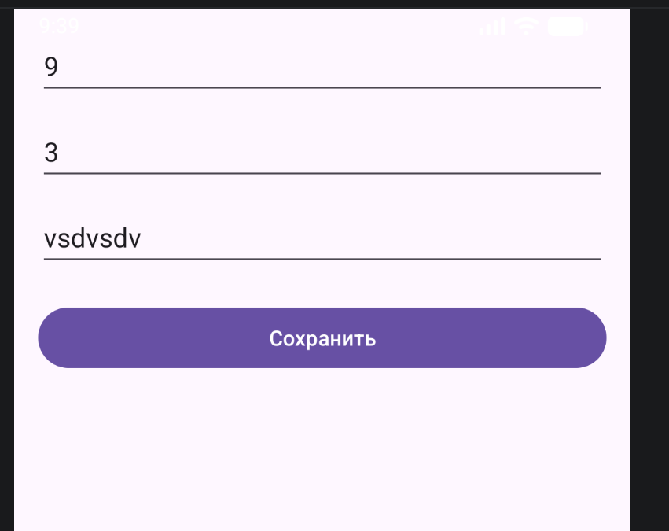
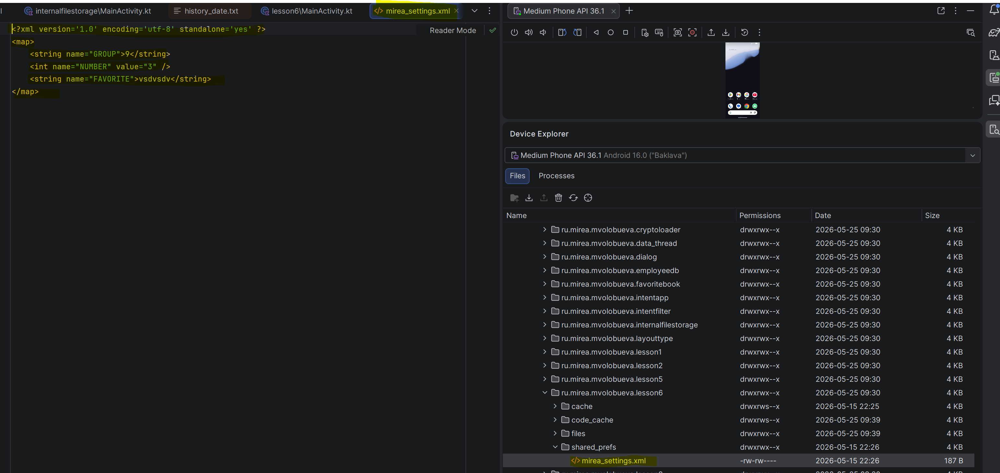
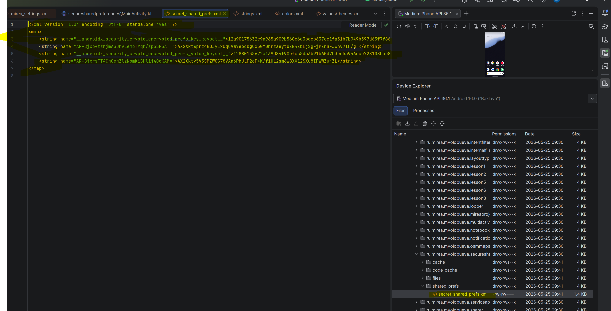
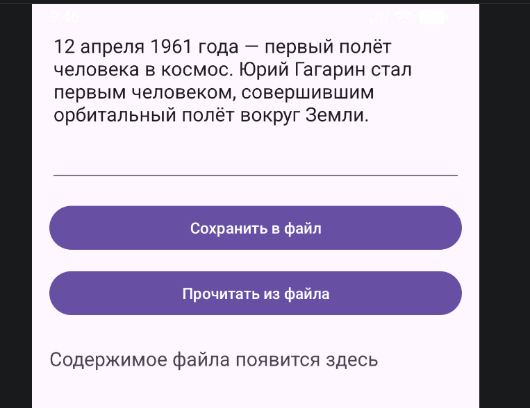
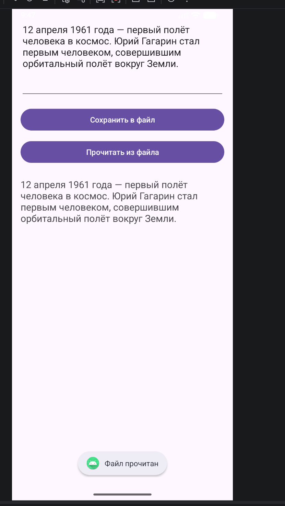
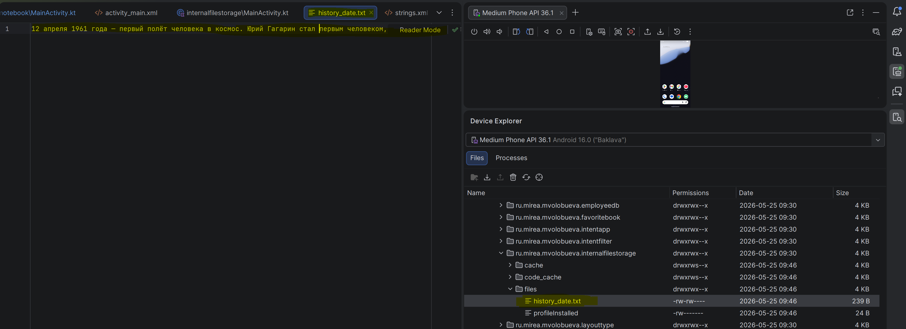
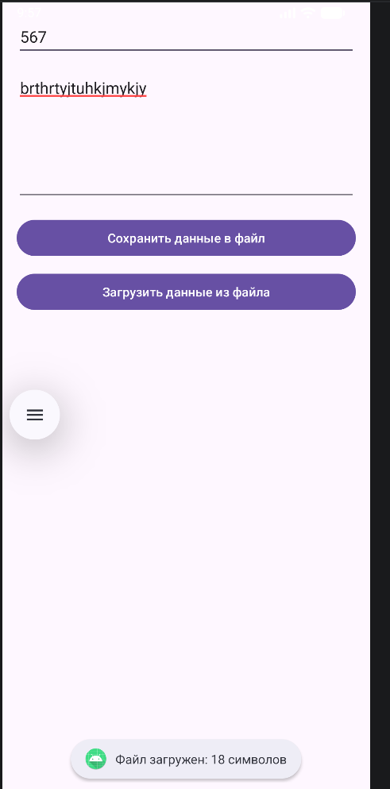
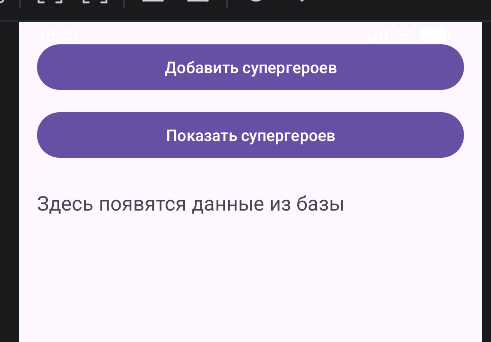
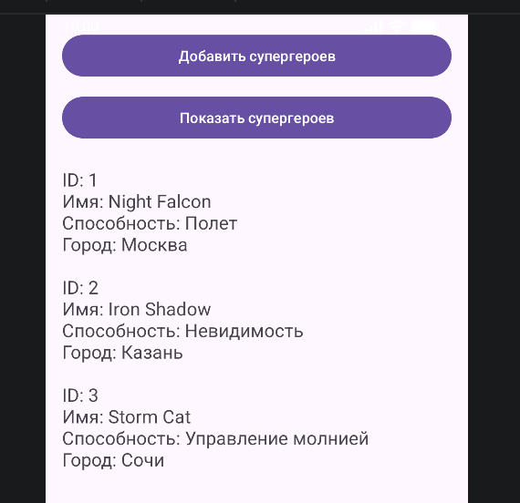

# Отчет по практической работе № 6
**Дисциплина:** Разработка мобильных приложений  
**Тема:** «Механизмы персистентности и стратегии хранения данных в экосистеме Android»  
**Язык реализации:** Kotlin

---

## Содержание
1. **Введение**
2. **Цель работы**
3. **Постановка задач и этапы реализации**
4. **Краткие теоретические сведения**
    - 4.1. Понятие персистентности данных
    - 4.2. SharedPreferences и вопросы безопасности
    - 4.3. Файловая система: Internal vs External Storage
    - 4.4. Архитектура Room Persistence Library
5. **Структура проекта и модульная организация**
6. **Ход выполнения работы**
    - 6.1. Модуль `app`: Работа с простыми настройками
    - 6.2. Модуль `securesharedpreferences`: Криптографическая защита
    - 6.3. Модуль `internalfilestorage`: Изолированное хранилище
    - 6.4. Модуль `notebook`: Внешнее хранилище документов
    - 6.5. Модуль `employeedb`: Реляционная база данных Room
7. **Сборка, запуск и верификация данных**
8. **Вывод по работе**

---

## 1. Цель работы
Фундаментальная цель данной практической работы заключается в детальном изучении и практическом освоении широкого спектра технологий хранения данных, доступных разработчику в ОС Android. Работа направлена на формирование навыков выбора оптимальной стратегии сохранения состояния приложения в зависимости от типа данных (настройки, медиафайлы, структурированные записи) и требований к информационной безопасности. В процессе выполнения закрепляются знания по работе с архитектурными компонентами Android Jetpack и низкоуровневыми потоками ввода-вывода (I/O).

## 2. Постановка задач
В ходе выполнения лабораторного цикла были поставлены следующие конкретные задачи:
1.  **Реализовать механизм SharedPreferences** для управления пользовательским профилем (группа, номер, предпочтения).
2.  **Интегрировать библиотеку Security Crypto** для защиты конфиденциальной информации с использованием аппаратного шифрования.
3.  **Организовать работу с внутренним хранилищем**, обеспечив изоляцию данных от других приложений.
4.  **Спроектировать систему управления файлами во внешнем каталоге**, используя стандарты Scoped Storage.
5.  **Разработать локальную СУБД на базе Room**, реализовав полную цепочку взаимодействия: от Entity до DAO и Singleton-базы данных.

---

## 3. Краткие теоретические сведения

### 3.1. SharedPreferences
Это легковесное решение для хранения данных типа «ключ-значение». На физическом уровне это XML-файл, доступный только приложению. Главное преимущество — высокая скорость работы с примитивными типами. Однако данный метод не подходит для хранения больших объемов информации или сложных структур.

### 3.2. EncryptedSharedPreferences
В современных приложениях хранение токенов или паролей в открытом виде недопустимо. Библиотека `androidx.security` позволяет автоматически шифровать данные с использованием стандарта AES-256. Мастер-ключ при этом генерируется в безопасной среде `Android KeyStore`, что предотвращает его компиляцию в коде или кражу при доступе к ФС.

### 3.3. Работа с файлами (Internal & External)
*   **Internal Storage:** Память, выделенная под «песочницу» приложения. Файлы здесь автоматически удаляются при деинсталляции и недоступны пользователю.
*   **External Storage (App-specific):** Публичная область памяти. Начиная с Android 10 (API 29), приложения работают в режиме Scoped Storage, имея доступ только к своим папкам (например, `Documents`, `Pictures`), не требуя при этом глобальных разрешений на чтение всей памяти.

### 3.4. Room Persistence Library
Room является абстракцией над SQLite. Она позволяет работать с базой данных на уровне объектов Kotlin. Room проверяет SQL-запросы на этапе компиляции, что исключает ошибки во время выполнения. Основные компоненты:
*   **Entity:** Класс, представляющий таблицу.
*   **DAO:** Интерфейс с методами `Insert`, `Update`, `Query`.
*   **Database:** Главная точка входа, обеспечивающая связь между кодом и SQLite.

---

## 4. Структура проекта
Проект построен по многомодульной схеме, что позволяет эффективно разделять зависимости и избегать конфликтов между библиотеками:

| Модуль | Ключевая технология | Назначение модуля |
|:---|:---|:---|
| `app` | SharedPreferences | Сохранение номера группы и любимого фильма. |
| `securesharedpreferences` | Security Crypto | Защищенное хранение имени поэта и изображений. |
| `internalfilestorage` | Internal Storage | Логирование исторической даты во внутреннюю память. |
| `notebook` | External Storage | Менеджер текстовых цитат во внешней памяти документов. |
| `employeedb` | Room ORM | База данных учета способностей вымышленных персонажей. |

---

## 5. Ход выполнения работы

### 5.1. Модуль app: SharedPreferences
В этом модуле разработан экран с полями ввода (`EditText`). Логика построена на использовании `Context.MODE_PRIVATE`.
*Комментарий к реализации:* При вызове `editor.apply()` запись происходит в фоновом потоке, что критически важно для плавности интерфейса.

   

   
**Листинг ключевого фрагмента (app):**
```kotlin
// Получение доступа к файлу настроек "mirea_settings"
sharedPreferences = getSharedPreferences("mirea_settings", Context.MODE_PRIVATE)

// Редактирование и сохранение данных
val editor = sharedPreferences.edit()
editor.putString("GROUP", group)
editor.putInt("NUMBER", number)
editor.putString("FAVORITE", favorite)
editor.apply() // Асинхронное сохранение изменений
```
*Файл реализации:* `app/src/main/java/ru/mirea/mvolobueva/lesson6/MainActivity.kt`.

### 5.2. Модуль securesharedpreferences: EncryptedSharedPreferences
Для работы с этим модулем в `build.gradle.kts` была добавлена зависимость `androidx.security:security-crypto:1.1.0`. Здесь мы инициализируем `MasterKey` с использованием схемы шифрования AES256_GCM.



**Листинг настройки защищенного хранилища:**
```kotlin
// Создание или получение мастер-ключа из KeyStore
val masterKey = MasterKey.Builder(this)
    .setKeyScheme(MasterKey.KeyScheme.AES256_GCM)
    .build()

// Инициализация зашифрованного экземпляра SharedPreferences
secureSharedPreferences = EncryptedSharedPreferences.create(
    this,
    "secret_shared_prefs",
    masterKey,
    EncryptedSharedPreferences.PrefKeyEncryptionScheme.AES256_SIV,
    EncryptedSharedPreferences.PrefValueEncryptionScheme.AES256_GCM
)
```
*Логика:* Теперь при попытке открыть файл `secret_shared_prefs.xml` через файловый менеджер на Root-устройстве, вместо текста будут видны нечитаемые зашифрованные символы.

### 5.3. Модуль internalfilestorage: Внутреннее хранилище
В данном модуле реализован механизм записи строки в файл `history_date.txt`. Для этого используются методы `openFileOutput` (для записи байтового массива) и `openFileInput` (для чтения).




**Листинг операций ввода-вывода:**
```kotlin
// Запись строки в файл во внутреннем хранилище
val outputStream = openFileOutput(fileName, Context.MODE_PRIVATE)
outputStream.write(text.toByteArray())
outputStream.close()

// Чтение и вывод содержимого в TextView
val inputStream = openFileInput(fileName)
val reader = inputStream.bufferedReader()
val result = reader.use { it.readText() }
```
*Примечание:* Метод `use` в Kotlin гарантирует закрытие потока данных даже в случае возникновения исключения, что предотвращает утечки памяти.

### 5.4. Модуль notebook: Работа с внешними документами


Модуль реализует простой текстовый редактор. Мы получаем путь к внешней папке документов приложения через `getExternalFilesDir(Environment.DIRECTORY_DOCUMENTS)`.

**Фрагмент кода работы с файлами:**
```kotlin
// Определение местоположения файла в каталоге документов
val path = getExternalFilesDir(Environment.DIRECTORY_DOCUMENTS)
val file = File(path, fileName)

// Чтение файла с использованием BufferedReader и кодировки UTF-8
val inputStream = file.inputStream()
val reader = inputStream.bufferedReader(Charsets.UTF_8)
val content = reader.readText()
```
*Преимущество:* Данный метод хранения позволяет сохранять файлы, которые не удаляются при очистке кеша, но автоматически стираются при полном удалении приложения, не засоряя память устройства.

### 5.5. Модуль employeedb: Локальная база данных Room




Это наиболее сложный модуль, использующий архитектуру Jetpack. Реализована БД для учета способностей супергероев.
1.  **Entity (Сущность):** Класс `Employee` с аннотацией `@Entity`, где `id` помечен как `@PrimaryKey` с автогенерацией.
2.  **DAO (Data Access Object):** Интерфейс `EmployeeDao`, содержащий аннотированные методы `@Query`, `@Insert`, `@Update`, `@Delete`.
3.  **AppDatabase:** Абстрактный класс, расширяющий `RoomDatabase`.
4.  **Класс App:** Наследует `Application`, создавая экземпляр базы данных при запуске приложения (паттерн Singleton).

**Описание Entity:**
```kotlin
@Entity(tableName = "employee")
data class Employee(
    @PrimaryKey(autoGenerate = true)
    var id: Long = 0,
    var name: String,
    var power: String,
    var city: String
)
```
*Пояснение по потокам:* В коде используется `allowMainThreadQueries()`. В рамках данной учебной задачи это допустимо, но в промышленной разработке все запросы должны выполняться асинхронно через Coroutines или RxJava.

---

## 6. Сборка и запуск
Сборка проекта осуществлялась с помощью Gradle Wrapper. Был использован PowerShell для выполнения команд сборки:

**Команда для компиляции:**
```powershell
.\gradlew.bat assembleDebug
```
После завершения процесса сборки, APK-файлы для каждого модуля были развернуты на эмуляторе. Проверка данных в `SharedPreferences` и `Room` проводилась через инструмент **App Inspection** в Android Studio. Это позволило в реальном времени наблюдать изменения в таблицах базы данных при добавлении новых "супергероев".

---

## 7. Вывод
В ходе выполнения практической работы №6 был успешно пройден путь от базовых до продвинутых технологий персистентности данных в мобильной разработке.
*   **SharedPreferences** являются идеальным решением для быстрых настроек.
*   **Crypto API** обеспечивает необходимый уровень защиты в условиях угроз безопасности данных.
*   **Системные вызовы I/O** позволили понять низкоуровневую работу с файловой системой Android.
*   **Room Persistence Library** показала себя как мощный и удобный инструмент для работы со структурированными базами данных, минимизируя вероятность ошибок в SQL-запросах.

Разработанный многомодульный проект может служить базой для создания более сложных систем хранения в будущем, включая интеграцию с облачными сервисами или сложными системами кеширования. Все поставленные задачи выполнены в полном объеме, проект успешно компилируется и функционирует.

--- 
