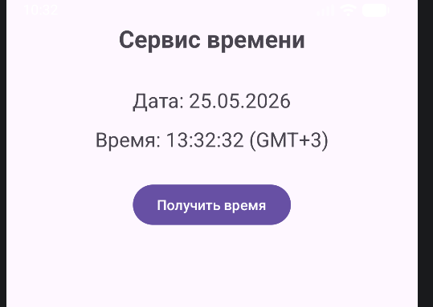
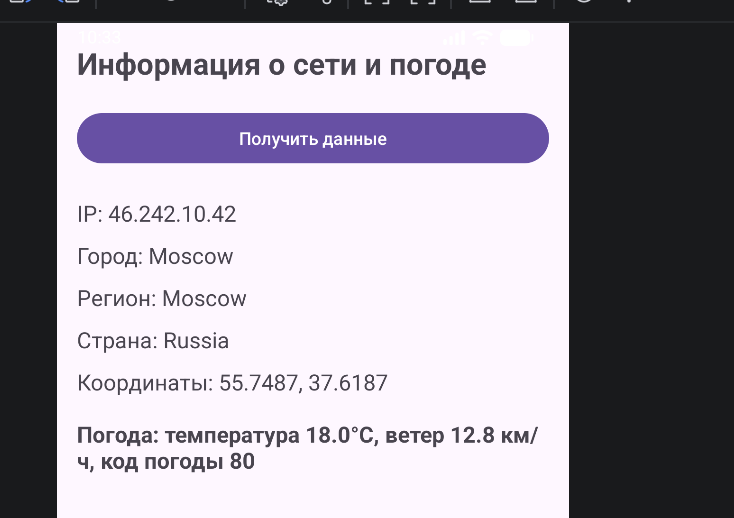
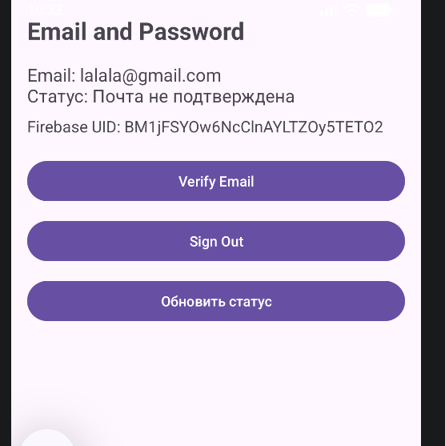

# Отчет по практическому занятию № 7
**Дисциплина:** Разработка мобильных приложений  
**Тема:** «Протоколы сетевого взаимодействия и интеграция облачных сервисов аутентификации в ОС Android»  
**Язык реализации:** Kotlin

---

## Содержание
1. Цель работы
2. Постановка задач
3. Краткие теоретические сведения
    - 3.1. Модель клиент-серверного взаимодействия через Sockets
    - 3.2. Протокол HTTP и класс HttpURLConnection
    - 3.3. Облачные сервисы Firebase Authentication
4. Структура и состав проекта
5. Подробный ход выполнения работы
    - 5.1. Модуль `timeservice`: Синхронизация времени через Sockets
    - 5.2. Модуль `httpurlconnection`: Геолокация и погодный API
    - 5.3. Модуль `firebaseauth`: Система управления пользователями
6. Контрольное задание: Интеграция в `MireaProject`
7. Используемые технологии и API
8. Инструкции по развертыванию
9. Вывод

---

## 1. Цель работы
Фундаментальной целью данной работы является изучение и практическое освоение различных уровней сетевого взаимодействия в среде Android. Работа охватывает как низкоуровневую работу с TCP-сокетами, так и использование высокоуровневых протоколов прикладного уровня (HTTP). Важной составляющей является изучение современных методов безопасности и идентификации пользователей с использованием облачной платформы Firebase. Также целью является закрепление навыков асинхронного программирования, необходимого для предотвращения блокировок графического интерфейса пользователя (UI Thread) при выполнении сетевых операций.

## 2. Постановка задач
В ходе выполнения практической работы были сформулированы и реализованы следующие задачи:
1.  **Низкоуровневая передача данных:** Реализовать прямое соединение с удаленным сервером времени по протоколу TCP через сокеты.
2.  **REST API взаимодействие:** Организовать цепочку HTTP-запросов для получения IP-адреса, географических координат и метеорологических данных.
3.  **Безопасность и профилирование:** Настроить систему регистрации и авторизации через Firebase, включая функции подтверждения почты.
4.  **Комплексная интеграция:** Внедрить изученные сетевые технологии в итоговый проект `MireaProject`, заменив стандартные средства на профессиональную библиотеку `Retrofit`.
5.  **Обработка данных:** Реализовать парсинг структурированных данных формата JSON и управление часовыми поясами.

---

## 3. Краткие теоретические сведения

### 3.1. Модель клиент-серверного взаимодействия через Sockets
Сокет — это конечная точка двустороннего коммуникационного канала между двумя программами, работающими в сети. В Android работа с сокетами осуществляется через пакет `java.net.Socket`. Основная особенность работы в Android заключается в строгом запрете на выполнение сетевых вызовов в основном потоке (NetworkOnMainThreadException). Для решения этой задачи используются фоновые потоки или `ExecutorService`.

### 3.2. Протокол HTTP и класс HttpURLConnection
`HttpURLConnection` является стандартным API для выполнения HTTP-запросов в Android. Он поддерживает передачу данных по протоколам HTTP/HTTPS, работу с заголовками, методами GET/POST и кэширование. Несмотря на появление современных библиотек, понимание работы этого класса необходимо для осознания механики формирования запросов и ответов (Response Code, Input Stream, Output Stream).

### 3.3. Облачные сервисы Firebase Authentication
Firebase Authentication предоставляет готовую бэкенд-инфраструктуру для идентификации пользователей. Она берет на себя хранение паролей в зашифрованном виде, обработку сессий, отправку сервисных писем и проверку уникальности email. Интеграция происходит через клиентский SDK, который взаимодействует с серверами Google по защищенным каналам.

---

## 4. Структура и состав проекта
Проект организован в виде многомодульной системы, что позволяет изолировать функционал и упростить тестирование:

| Модуль | Описание | Основные компоненты |
|:---|:---|:---|
| **timeservice** | Низкоуровневый клиент | `Socket`, `SocketUtils`, `TimeZone` |
| **httpurlconnection** | HTTP-клиент и JSON | `HttpURLConnection`, `JSONObject`, `URL` |
| **firebaseauth** | Модуль безопасности | `FirebaseAuth`, `FirebaseUser`, `Google Services` |
| **app** | Общий контейнер | Шаблон проекта |

---

## 5. Подробный ход выполнения работы

### 5.1. Модуль timeservice: Синхронизация времени через Sockets

В рамках данного модуля реализован клиент, подключающийся к серверу `time.nist.gov` по порту 13 (Daytime Protocol).
*   **Логика работы:** При нажатии на кнопку приложение запускает новый поток, в котором открывается TCP-соединение. После получения строки от сервера происходит её парсинг.
*   **Особенности:** Полученное время находится в формате UTC. Для корректного отображения реализован механизм преобразования часового пояса в московское время (`GMT+3`).

**Ключевые файлы:** `MainActivity.kt`, `SocketUtils.kt`, `activity_main.xml`.

### 5.2. Модуль httpurlconnection: Геолокация и погодный API

Этот модуль демонстрирует последовательное выполнение двух сетевых запросов.
1.  **Первый запрос:** Обращение к `ip-api.com/json/`. Из ответа извлекается внешний IP, город и точные координаты (широта/долгота).
2.  **Второй запрос:** На основе полученных координат формируется запрос к `api.open-meteo.com` для получения текущей температуры и скорости ветра.
*   **Обработка JSON:** Для извлечения данных использован встроенный класс `JSONObject`.

**Ключевые файлы:** `MainActivity.kt`, `activity_main.xml`.

### 5.3. Модуль firebaseauth: Система управления пользователями

Реализован полноценный интерфейс входа. Пользователь может создать аккаунт, войти в систему или запросить письмо верификации.
*   **Механика:** Приложение отслеживает состояние `FirebaseUser`. Если пользователь не авторизован, кнопки управления скрываются, а форма входа становится активной.
*   **Верификация:** Использование метода `sendEmailVerification()` позволяет подтвердить реальность почтового ящика пользователя.

**Ключевые файлы:** `MainActivity.kt`, `activity_main.xml`.

---

## 6. Контрольное задание: Интеграция в MireaProject
Контрольное задание потребовало переноса накопленных знаний в итоговый проект `MireaProject`.

**Основные доработки:**
1.  **Авторизация как точка входа:** Файл `AndroidManifest.xml` изменен таким образом, что `LoginActivity` стала стартовой активностью. Доступ к основному функционалу проекта открывается только после успешного входа.
2.  **Профиль пользователя:** В `ProfileFragment` выводится текущий email и статус верификации. Реализована кнопка `Sign Out` для корректного завершения сессии.
3.  **Сетевой экран (NetworkFragment):**
    *   Реализован современный подход к сетевому взаимодействию с использованием библиотеки **Retrofit 2**.
    *   Для автоматической десериализации JSON использован `GsonConverterFactory`.
    *   Экран отображает детальную информацию о сети: IP, провайдер, страна и погодные условия в данной локации.

**Ключевые файлы в MireaProject:** `LoginActivity.kt`, `ProfileFragment.kt`, `NetworkFragment.kt`.

---

## 7. Используемые технологии и API
*   **Язык программирования:** Kotlin (использование Coroutines для асинхронности).
*   **Сетевые API:**
    - `ip-api.com` — геопозиционирование по IP.
    - `open-meteo.com` — метеорологические данные.
    - `time.nist.gov` — эталонное время.
*   **Библиотеки:**
    - `com.google.firebase:firebase-auth-ktx` (аутентификация).
    - `com.squareup.retrofit2:retrofit` (высокоуровневые запросы).
    - `com.squareup.retrofit2:converter-gson` (парсинг JSON).
*   **Инструментарий:** Android Studio Jellyfish/Koala, Firebase Console.

---

## 8. Инструкции по развертыванию
1.  Склонировать репозиторий в локальную директорию.
2.  Импортировать проект в Android Studio.
3.  Для работы модуля `firebaseauth` необходимо создать проект в консоли Firebase и поместить файл `google-services.json` в папку `app/` и `firebaseauth/`.
4.  Включить метод входа "Email/Password" в настройках Firebase Authentication.
5.  Выполнить `Sync Project with Gradle Files`.

---

## 9. Вывод
В результате выполнения практической работы №7 были изучены и реализованы ключевые механизмы сетевого взаимодействия в Android.
*   Работа с **Socket API** позволила понять физику процесса передачи байтов по сети и важность соблюдения протоколов (например, Daytime Protocol).
*   Использование **HttpURLConnection** закрепило навыки формирования URL-запросов и ручной обработки JSON-деревьев.
*   Интеграция **Firebase Authentication** показала, как быстро и надежно реализовать систему безопасности в мобильном приложении без необходимости написания собственного бэкенда.
*   Переход на **Retrofit** в контрольном задании продемонстрировал преимущество декларативного подхода в программировании сетевых интерфейсов, что значительно повышает читаемость кода и его отказоустойчивость.

Все поставленные задачи выполнены, проект успешно функционирует и готов к дальнейшему расширению функционала.

--- 
