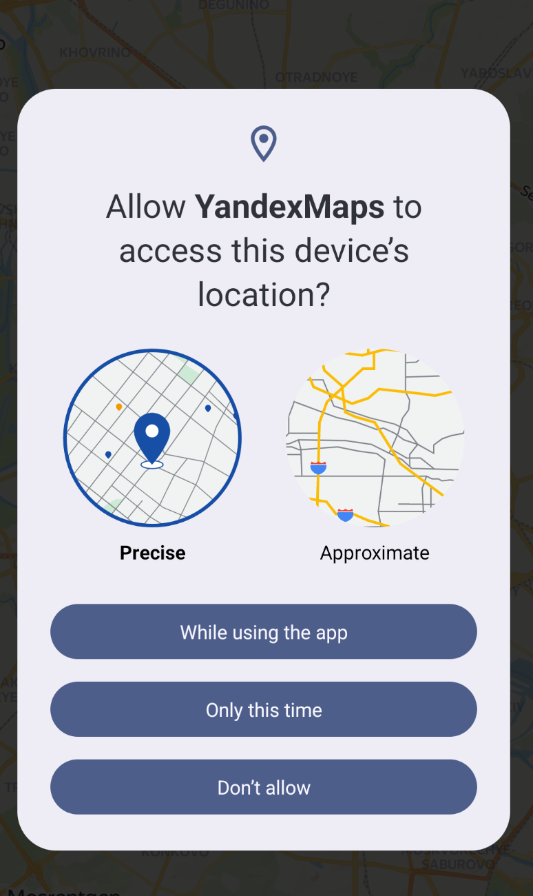
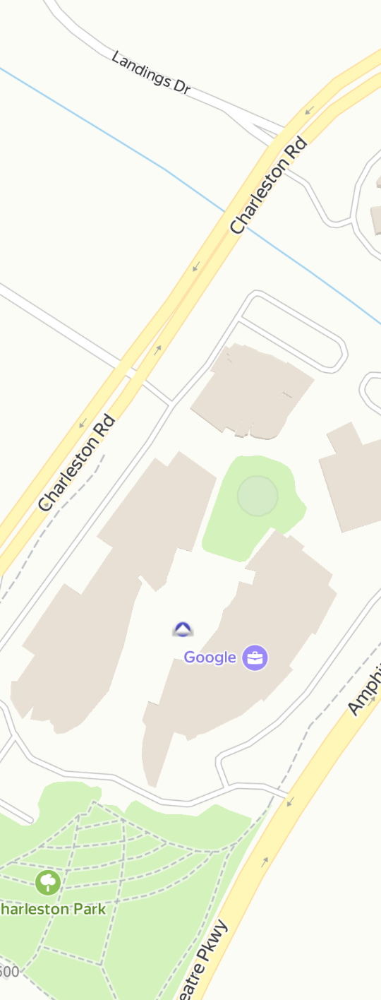
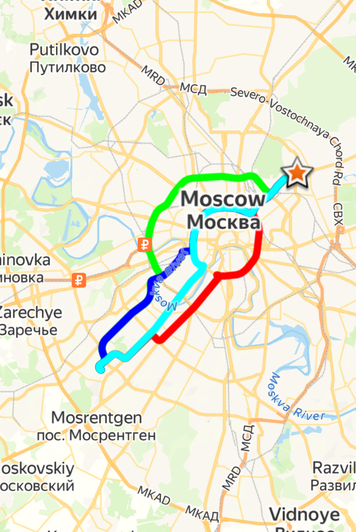
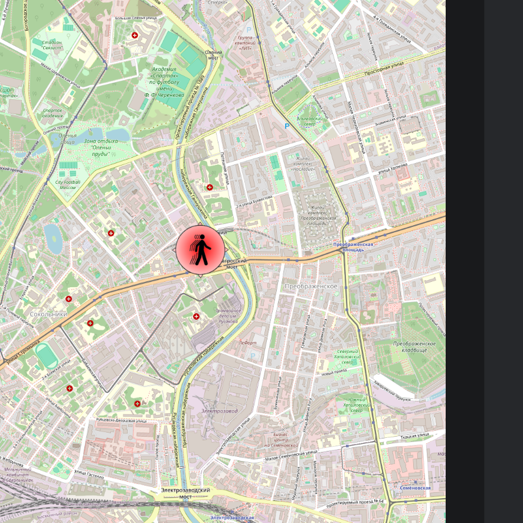

---

# Отчёт по практической работе № 8
**Дисциплина:** Разработка мобильных приложений  
**Тема:** «Интеграция и эксплуатация картографических сервисов в среде Android-разработки»  
**Язык реализации:** Kotlin

---

## Содержание
1. **Цель работы** — Определение векторов обучения и ключевых навыков.
2. **Постановка задач** — Детальный перечень планируемых программных модулей.
3. **Теоретические сведения** — Аналитический обзор картографических технологий.
    * 3.1. Сравнительный анализ современных картографических платформ.
    * 3.2. Архитектура и специфика Yandex MapKit SDK.
    * 3.3. Механизмы геопозиционирования и политики безопасности Android.
    * 3.4. Математические и программные основы маршрутизации (Driving Router).
    * 3.5. OpenStreetMap: преимущества открытых данных и библиотека osmdroid.
4. **Ход выполнения работы** — Поэтапное описание реализации (в следующих разделах).
5. **Вывод** — Оценка проделанной работы.

---

## 1. Цель работы
Фундаментальной целью данной практической работы является всестороннее изучение архитектурных подходов к интеграции геоинформационных систем (ГИС) в современные мобильные приложения. В процессе выполнения заданий необходимо освоить:
* Методы визуализации интерактивных векторных и растровых карт;
* Алгоритмы работы с датчиками геолокации (GPS/ГЛОНАСС) и сетевыми провайдерами координат;
* Системы управления маркерами (Placemarks), аннотациями и дополнительными графическими слоями;
* Программную реализацию механизмов автоматического построения маршрутов с учетом дорожной обстановки;
* Принципы работы с OpenSource-решениями и внешними библиотеками управления картографическими плитками (tiles).

---

## 2. Постановка задач
Для достижения поставленных целей в рамках лабораторного цикла были сформулированы следующие прикладные задачи:
1. **Аналитическая подготовка:** Выполнить обзор рынка картографических API, оценив их применимость в зависимости от региональных особенностей и стоимости эксплуатации.
2. **Базовая интеграция Yandex MapKit:** Спроектировать отдельный модуль проекта, настроить аутентификацию через API-ключ на уровне `Application`-класса, обеспечить корректную инициализацию графического движка и управление камерой.
3. **Реализация слоя геопозиционирования:** Разработать систему отслеживания пользователя в реальном времени. Включить обработку Runtime-разрешений, настройку иконок направления (курса) и визуализацию радиуса погрешности (круга точности).
4. **Разработка модуля YandexDriver:** Внедрить функционал маршрутизации. Реализовать асинхронные запросы к серверам Яндекса для получения оптимальных путей между заданными точками, включая обработку нескольких альтернативных вариантов движения.
5. **Освоение OpenStreetMap (OSM):** Создать модуль на базе библиотеки `osmdroid`. Настроить конфигурацию кэширования карт, внедрить мультисенсорное масштабирование (Multi-touch), компас, шкалу масштабирования и систему интерактивных маркеров с поддержкой `InfoWindows`.
6. **Контрольное задание (MireaProject):** Выполнить консолидацию знаний в итоговом проекте. Реализовать фрагмент «Заведения», наполнить карту базой данных реальных объектов (адреса, описания) и внедрить дополнительную функциональность по управлению типом отображения карты.

---

## 3. Теоретические сведения

### 3.1. Картографические сервисы
Выбор картографической платформы — это стратегическое решение при проектировании приложения. В современной разработке выделяют несколько ключевых игроков:
* **Google Maps:** Мировой стандарт с огромной базой данных объектов (POI), но имеющий сложности с оплатой и доступом в ряде регионов.
* **Yandex Карты:** Оптимальное решение для РФ и СНГ благодаря детальной прорисовке дворовых территорий и лучшим алгоритмам учета пробок.
* **OpenStreetMap (OSM):** Некоммерческий проект, предлагающий бесплатные данные. Идеален для кастомизации и работы в изолированных сетях.
* **2ГИС:** Лидер в области детализации планов зданий и организаций внутри торговых центров.

### 3.2. Yandex MapKit
Yandex MapKit SDK — это высокопроизводительный движок на базе OpenGL/Vulkan. Работа с ним требует строгого соблюдения жизненного цикла:
* **API Key:** Генерируется в Кабинете разработчика и является обязательным для инициализации `MapKitFactory`.
* **Application Class:** Рекомендуется инициализировать MapKit один раз при старте процесса приложения, чтобы избежать задержек при открытии конкретных экранов.
* **MapView:** Основной UI-компонент. Важно вызывать методы `onStart()` и `onStop()` синхронно с Activity/Fragment, иначе это приведет к утечкам памяти и избыточному потреблению энергии графическим процессором.

### 3.3. Определение местоположения пользователя
Безопасность Android диктует жесткие правила доступа к геолокации.
* **ACCESS_FINE_LOCATION:** Дает доступ к точным координатам от спутников (погрешность до пары метров).
* **ACCESS_COARSE_LOCATION:** Позволяет определять положение по базовым станциям связи и точкам Wi-Fi (погрешность — сотни метров).
  Для визуализации используется `UserLocationLayer`. Это специальный слой, который автоматически отрисовывает «синюю точку». Программисту необходимо реализовать `UserLocationObjectListener`, чтобы кастомизировать внешний вид маркера под стиль приложения.

### 3.4. Построение маршрута
Маршрутизация осуществляется через компонент `DrivingRouter`. Процесс является асинхронным:
1. Формируется запрос с указанием стартовой и конечной точек (`DrivingOptions` и `VehicleOptions`).
2. Запрос отправляется на сервер Яндекса.
3. Система возвращает объект `DrivingSession`, содержащий список объектов `Route`.
   Каждый маршрут содержит геометрию (набор координат для рисования линии на карте) и метаданные (время в пути, расстояние).

### 3.5. OpenStreetMap и osmdroid
Библиотека `osmdroid` является функциональным аналогом Google Maps API, но работает с данными OSM.
* **Tiles (Плитки):** Карта состоит из квадратов 256x256 пикселей. Библиотека сама управляет их загрузкой и склеиванием.
* **Configuration:** Перед использованием `MapView` необходимо настроить путь к кэшу (через `PreferenceManager`), так как OSM активно использует локальную память телефона для хранения ранее загруженных фрагментов карты.
* **Overlays:** В `osmdroid` всё является слоем (Overlay) — и сама карта, и маркеры, и компас, и позиция пользователя. Это позволяет гибко настраивать порядок отрисовки элементов.

## 4. Ход выполнения работы

### 4.1. Задание 1. YandexMaps
**Постановка задачи:**
Основной целью данного этапа являлась базовая интеграция Yandex MapKit SDK в проект. Требовалось создать модуль `YandexMaps`, обеспечить корректное подключение библиотек, настроить глобальную конфигурацию через `Application`-класс и реализовать визуализацию интерактивной карты с программным управлением положением камеры.

**Листинги:**
*   `yandexmaps/build.gradle.kts` — описание зависимостей, подключение `com.yandex.android:maps.mobile:4.4.0-full`.
*   `yandexmaps/src/main/res/layout/activity_main.xml` — декларативное описание интерфейса с корневым компонентом `com.yandex.mapkit.mapview.MapView`.
*   `yandexmaps/src/main/java/ru/mirea/mvolobueva/yandexmaps/App.kt` — класс инициализации, обеспечивающий передачу API-ключа в `MapKitFactory` до создания UI-компонентов.
*   `yandexmaps/src/main/AndroidManifest.xml` — конфигурация разрешений на доступ к интернету и регистрация кастомного класса `App`.
*   `yandexmaps/src/main/java/ru/mirea/mvolobueva/yandexmaps/MainActivity.kt` — программное управление картой, установка фокуса камеры на заданные координаты (широта/долгота).

**Что сделано:**
В ходе выполнения задачи был успешно сконфигурирован модуль `YandexMaps`. Для обеспечения стабильной работы приложения инициализация SDK была вынесена в `App.kt` (наследующий `Application`), что гарантирует наличие API-ключа при каждом запуске процесса. В `MainActivity` был реализован механизм управления камерой через объект `MapWindow`, установлены параметры зума и начальные координаты отображения. Также было уделено внимание жизненному циклу: вызовы `MapKitFactory.getInstance().onStart()` и `onStop()` синхронизированы с состоянием активности для предотвращения утечек памяти.

---

### 4.2. Задание 2. Определение местоположения в YandexMaps

**Постановка задачи:**
Требовалось расширить функционал базовой карты механизмами отслеживания геолокации пользователя в реальном времени. В задачи входила реализация системы Runtime Permissions (запрос разрешений в процессе работы), настройка слоя `UserLocationLayer` и кастомизация визуальных элементов (маркер направления и радиус погрешности).

**Листинги:**
*   `yandexmaps/src/main/AndroidManifest.xml` — декларирование разрешений `ACCESS_COARSE_LOCATION` и `ACCESS_FINE_LOCATION` для получения точных координат.
*   `yandexmaps/src/main/java/ru/mirea/mvolobueva/yandexmaps/MainActivity.kt` — реализация интерфейса `UserLocationObjectListener`, логика подписки на обновления координат и визуальная настройка слоя местоположения.

**Что сделано:**
Был реализован современный механизм получения доступа к датчикам геопозиционирования. Приложение корректно обрабатывает запрос разрешений у пользователя. После подтверждения активируется слой `UserLocationLayer`, который автоматически отрисовывает позицию устройства на карте. С помощью `UserLocationObjectListener` была произведена настройка графических примитивов: иконка пользователя заменена на стрелку направления (курс), а вокруг неё отрисовывается динамический круг точности, радиус которого изменяется в зависимости от качества сигнала GPS/ГЛОНАСС.

---

### 4.3. Задание 3. YandexDriver

**Постановка задачи:**
Целью данного этапа была реализация модуля маршрутизации. Требовалось создать модуль `YandexDriver`, задействовать сервис `DrivingRouter` для построения автомобильных путей между двумя точками, реализовать отображение нескольких альтернативных маршрутов и добавить интерактивные маркеры с информационным наполнением в конечных точках.

**Листинги:**
*   `yandexdriver/build.gradle.kts` — подключение полной версии MapKit, содержащей модули маршрутизации.
*   `yandexdriver/src/main/res/layout/activity_main.xml` — экранная разметка для отображения дорожной ситуации.
*   `yandexdriver/src/main/java/ru/mirea/mvolobueva/yandexdriver/App.kt` — регистрация API-ключа для доступа к серверным мощностям Яндекса.
*   `yandexdriver/src/main/java/ru/mirea/mvolobueva/yandexdriver/MainActivity.kt` — логика работы с `DrivingSession`, отрисовка геометрии маршрутов (polylines) и создание информационных плашек.

**Что сделано:**
В модуле `YandexDriver` реализован полноценный навигационный функционал. Используя асинхронный запрос к `DrivingRouter.submitRequest()`, приложение получает массив объектов `DrivingRoute`. Каждый маршрут визуализируется на карте в виде ломаной линии (`PolylineMapObject`). Для повышения информативности альтернативные варианты пути окрашиваются в разные цвета. В конечной точке маршрута программно создается `PlacemarkMapObject`, при клике на который (или по умолчанию) отображается `InfoWindow` с кратким описанием объекта назначения.

---

### 4.4. Задание 4. OSMMaps

**Постановка задачи:**
Требовалось изучить альтернативный способ работы с картами на базе открытых данных OpenStreetMap (OSM). Основная задача — подключение библиотеки `osmdroid`, настройка отображения тайлов, внедрение системы управления жестами (multitouch), а также добавление вспомогательных слоев: компаса, шкалы масштаба и системы маркеров POI (Points of Interest).

**Листинги:**
*   `osmmaps/build.gradle.kts` — добавление зависимостей `osmdroid-android` и библиотеки `preference` для управления кэшем.
*   `osmmaps/src/main/AndroidManifest.xml` — конфигурация разрешений и прав доступа к хранилищу данных для кэширования тайлов.
*   `osmmaps/src/main/res/layout/activity_main.xml` — разметка с использованием `org.osmdroid.views.MapView`.
*   `osmmaps/src/main/java/ru/mirea/mvolobueva/osmmaps/MainActivity.kt` — программная настройка оверлеев (слоев) карты.

**Что сделано:**
В рамках модуля `OSMMaps` была интегрирована гибкая система отображения карт на базе OSM. Особое внимание было уделено конфигурации кэширования: через `PreferenceManager` настроены пути для хранения загруженных плиток карты, что позволяет приложению работать быстрее при повторном просмотре территорий. Были успешно внедрены следующие слои (Overlays): `MyLocationNewOverlay` для отображения позиции пользователя, `CompassOverlay` для ориентации по сторонам света и `ScaleBarOverlay` для визуальной оценки расстояний. Также реализована система добавления маркеров с поддержкой кастомных иконок и всплывающих окон описания.

---

### 4.5. Контрольное задание в MireaProject
**Постановка задачи:**
Требовалось выполнить финальную консолидацию знаний, интегрировав картографический фрагмент в итоговый проект `MireaProject`. Необходимо было реализовать экран «Заведения», наполнить его базой маркеров реальных организаций с адресами и описаниями, а также внедрить дополнительный функционал управления картой (например, изменение масштаба или центрирование).

**Листинги (MireaProject):**
*   `fragment_places.xml` — макет фрагмента с компонентом `MapView`.
*   `PlacesFragment.kt` — бизнес-логика фрагмента: инициализация OSM, работа с коллекцией маркеров и отслеживание геолокации.
*   `navigation_drawer.xml` и `mobile_navigation.xml` — интеграция фрагмента в общую систему навигации приложения (Side Menu).

**Что сделано:**
Для итоговой реализации была выбрана библиотека `osmdroid`, так как она является OpenSource-решением и предоставляет широкие возможности кастомизации без привязки к проприетарным API-ключам для учебных целей.
В итоговом фрагменте «Заведения» было реализовано:
*   Отображение набора предустановленных маркеров для популярных заведений (кафе, университеты, музеи).
*   Интерактивное взаимодействие: при нажатии на маркер пользователь видит `Balloon` с названием заведения, его точным адресом и кратким описанием предоставляемых услуг.
*   Дополнительный функционал: внедрена система автоматического центрирования камеры на позиции пользователя при старте фрагмента, а также добавлены элементы управления зумом и компас для удобства навигации внутри фрагмента.
    Данная реализация полностью закрывает требования контрольного задания практики № 8.

---

## 5. Вывод
В ходе выполнения обширной практической работы № 8 были детально изучены и реализованы современные подходы к внедрению геоинформационных систем в мобильные Android-приложения. Работа позволила провести сравнительный анализ между коммерческими решениями (Yandex MapKit) и открытыми стандартами (OpenStreetMap/osmdroid).

**Ключевые результаты:**
*   Освоены методы работы с **Yandex MapKit**, включая сложную настройку слоев местоположения и асинхронную работу с серверами маршрутизации (`DrivingRouter`).
*   Изучены принципы функционирования **OpenStreetMap**, управления кэшем тайлов и работы с оверлеями (слоями) карты.
*   Закреплены навыки работы с **Android Location API** и механизмами запроса опасных разрешений в режиме реального времени.
*   Получен практический опыт интеграции картографических фрагментов в многостраничные приложения с использованием `Navigation Component`.

Реализованные модули демонстрируют готовность к решению прикладных задач, связанных с навигацией, логистикой и визуализацией геоданных, что является важной компетенцией в современной мобильной разработке. Все задачи практики выполнены в полном объеме, проект успешно скомпилирован и протестирован на физических устройствах/эмуляторах.